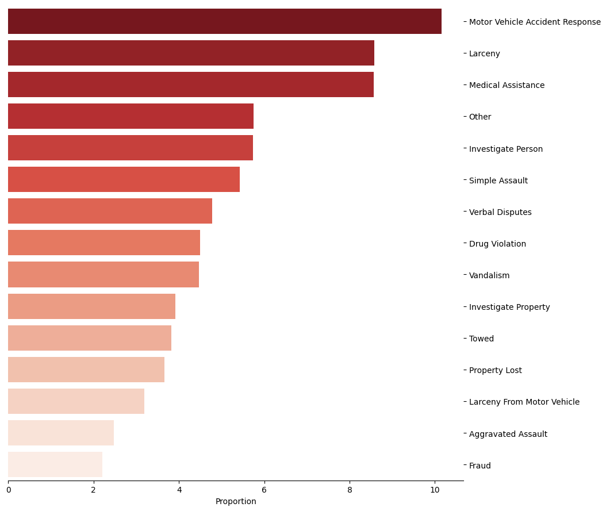
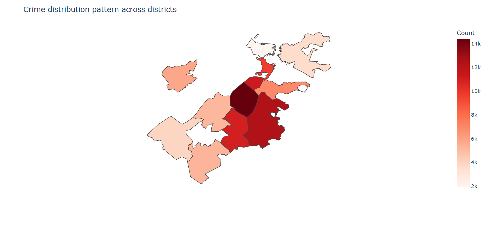
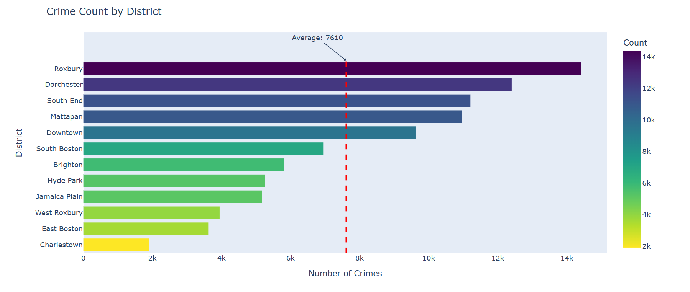

# Boston Crime EDA (2018)

Github won't render this notebook... Access the notebook from my personal website below;

## Introduction
This project focuses on exploratory data analysis (EDA) of Boston crime data(2018). The goal is to gain insights into the patterns, trends, and characteristics of crimes reported in the city. By analyzing the data, we aim to uncover valuable information that can aid in understanding crime dynamics and support decision-making processes for law enforcement agencies and policymakers.

## Dataset
The project utilizes a comprehensive dataset made publicly available by the Boston Police Department containing information about crimes reported in Boston. The dataset includes various attributes such as the type of crime, location, date and time of occurrence, and other relevant details. This dataset provides a rich source of information to explore and analyze the crime landscape in Boston.

## Objectives
The key objectives of the Boston Crime EDA project are as follows:

1. **Data Exploration**: Perform initial exploratory data analysis to understand the structure and content of the dataset. This involves examining the data types, identifying missing values, and gaining a general overview of the data distribution.

2. **Crime Patterns**: Identify patterns and trends in crime incidents over time. Analyze the frequency of different types of crimes, visualize the spatial distribution of incidents, and investigate any seasonal or temporal patterns.

3. **Crime Categories**:Explore the distribution of crimes across various categories and determine if certain types of crimes are more prevalent than others.

4. **Hotspots Analysis**: Identify crime hotspots in Boston by analyzing the concentration of incidents in different geographical areas. Used choropleth to pinpoint neighbourhoods with higher crime rates.

5. **Time Analysis**: Analyze the temporal aspects of crime incidents, including monthly, day-wise, and hourly patterns. Investigate whether certain days or times of the day are associated with higher crime rates.

6. **Data Visualization**: Utilize various data visualization techniques such as charts, graphs, and maps to effectively communicate the findings. Visual representations can help highlight patterns, outliers, and relationships within the data.

7. **Insights and Recommendations**: Summarize the key insights derived from the EDA process and provide actionable recommendations for relevant stakeholders. These insights can contribute to informed decision-making and the development of strategies to address crime-related challenges in Boston.

## Sample Snaps

## Tools and Libraries
The Boston Crime EDA project utilizes the following tools and libraries:

- Jupyter Notebook: Provides an interactive environment for data exploration, analysis, and visualization.
- Python: The primary programming language for implementing the EDA tasks.
- Pandas: Used for data manipulation and analysis.
- Numpy: Used as a complement for pandas.
- Matplotlib, Seaborn and Plotly: Used for data visualization and creating informative plots.

## Conclusion
The Boston Crime EDA project aims to uncover insights and patterns within the crime data of Boston. By analyzing the dataset and utilizing various statistical and visualization techniques, we can gain a deeper understanding of crime dynamics in the city. The findings and recommendations derived from this analysis can assist in addressing and mitigating crime-related issues, ultimately contributing to a safer and more secure community.

## Additional Note
- If the website takes too long to load, you can download the HTML file and view it locally.
  - Click ➡️ [here](https://raw.githubusercontent.com/Nirmal-Data-Scientist/Boston-Crime-EDA/main/index.html) to access the raw HTML file.
  - Right-click on the page and select "Save As" or "Save Page As" (option may vary).
  - Choose the save location on your computer and click "Save".
  - Navigate to the saved location on your computer.
  - Double-click on the "index.html" file to open it in a web browser.
  - The EDA work will now be displayed locally in your web browser for exploration.

These steps will allow you to easily download the HTML file and view the EDA work locally on your computer.
